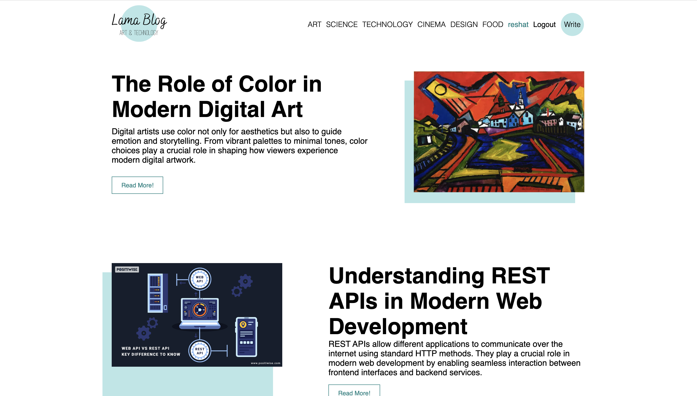
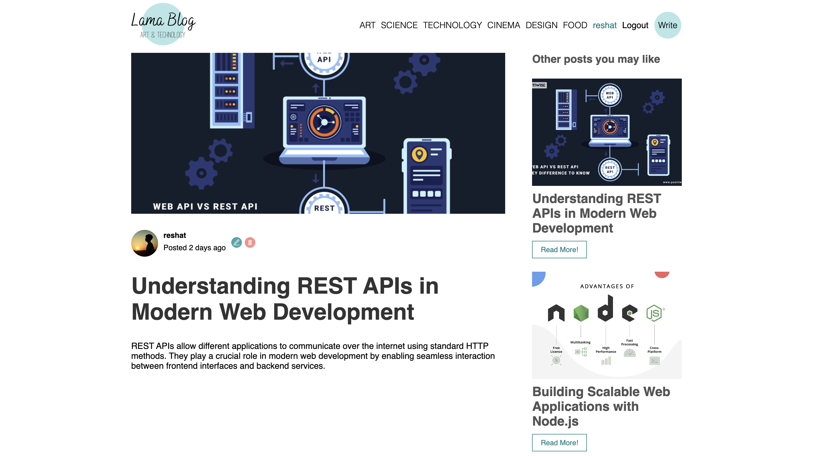
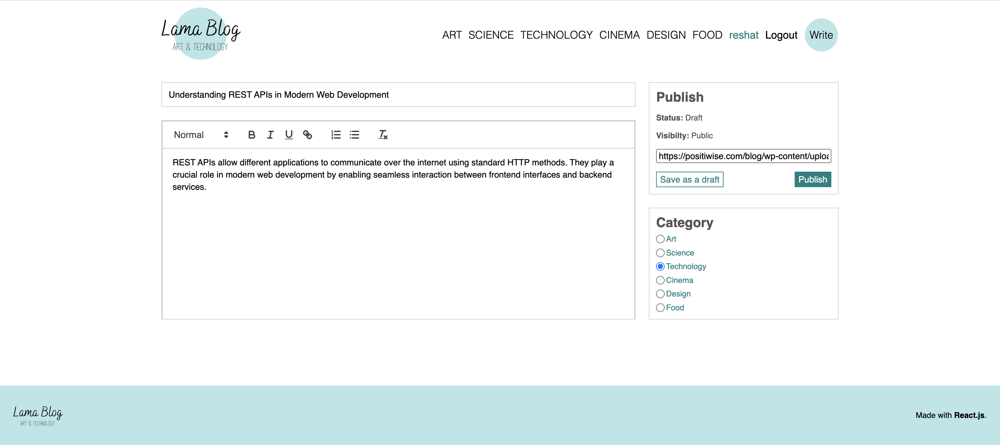
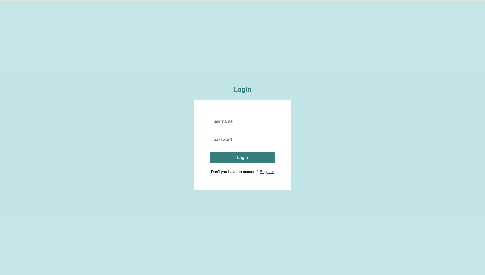

# 📝 Blog – Full Stack Blogging Platform

A full-stack blog application built with **React, Node.js, Express, and MySQL**.  
The project demonstrates REST API architecture, authentication workflows, database integration, and a modern React-based user interface.

🔗 **Live Demo:** https://blog-application-psi-seven.vercel.app/  
⚙️ **Backend API:** https://blog-application-b7d5.onrender.com  
📂 **Repository:** https://github.com/muhamedismaili/Blog-Application  

---

## 🚀 Overview

This blog platform allows users to create, manage, and read blog posts through a modern web interface connected to a backend REST API.

Users can:

- Browse blog posts  
- Read individual articles  
- Create new posts  
- Edit or delete their own content  
- Authenticate securely through login and registration  

The project demonstrates **full-stack development**, integrating a **React frontend with a Node.js backend and MySQL database**.

---

## 🛠 Tech Stack

### Frontend
- React  
- React Router  
- JavaScript (ES6+)  
- CSS  

### Backend
- Node.js  
- Express.js  
- REST API architecture  
- JWT Authentication  

### Database
- MySQL  
- Relational database management  

### Deployment
- Vercel (Frontend)  
- Render (Backend API)  
- Aiven (Cloud Database)

---

## ✨ Key Features

- Full-stack architecture with separated frontend and backend  
- REST API communication between client and server  
- JWT-based authentication and secure login/registration system  
- Create, update, and delete blog posts  
- Category-based filtering of articles  
- Image upload for blog posts  
- Responsive user interface  
- Protected routes for authenticated users  

---

## 🧠 Architecture

The application follows a **modular full-stack architecture**.

### Frontend (React)

- Component-based UI structure  
- Page-based routing using React Router  
- Axios API communication with backend  
- Authentication state management  

### Backend (Node.js / Express)

- RESTful API endpoints for posts, authentication, and user management
- Controller-based route structure  
- Middleware for authentication and authorization  
- Database queries using MySQL  

### Database (MySQL)

- Relational schema for users and posts  
- Secure password storage using hashing  

---

## 📂 Project Structure

```
Blog-Application/
│
├── api/                     # Node.js / Express backend
│   ├── controllers/
│   │   ├── auth.js
│   │   └── post.js
│   │
│   ├── routes/
│   │   ├── auth.js
│   │   └── posts.js
│   │
│   ├── db.js                # MySQL database connection
│   ├── index.js             # Express server entry point
│   └── package.json
│
├── client/                  # React frontend (Vite)
│   ├── public/
│   ├── src/
│   │   ├── components/
│   │   ├── context/
│   │   ├── img/
│   │   ├── pages/
│   │   ├── App.jsx
│   │   ├── main.jsx
│   │   └── style.scss
│   │
│   ├── index.html
│   ├── vite.config.js
│   └── package.json
│
└── README.md
```

## 📸 Screenshots

### Home Page


Displays all blog posts with category filtering and navigation.

---

### Single Post Page


Shows a detailed blog article including title, content, and author information.

---

### Write Post Page


Interface for creating new blog posts with title, category, and content editor.

---

### Login Page


User authentication page allowing secure login to access protected features.

---

## ⚙️ Installation & Setup

Clone the repository and run the project locally.

```bash
git clone https://github.com/muhamedismaili/Blog-Application.git
cd Blog-Application
```

# Install backend dependencies
```bash
cd api
npm install
```

# Run backend server
```bash
npm start
```

# Install frontend dependencies
```bash
cd ../client
npm install
```

# Run frontend
```bash
npm run dev
```

## 📈 What This Project Demonstrates

- Full-stack application architecture  
- REST API design and integration  
- Authentication and authorization workflows  
- Relational database design using MySQL  
- CRUD operations for dynamic content management  
- Frontend–backend communication using HTTP requests  
- Deployment of a multi-service application  

---

## 👨‍💻 Author

**Muhamed Ismaili**  
Computer Science & Engineering – UIST Ohrid  

📧 muhamed.is2020@gmail.com  
🔗 https://www.linkedin.com/in/muhamed-ismaili-4bb8343a9/

---

## 📄 License

Developed for educational and portfolio purposes.
